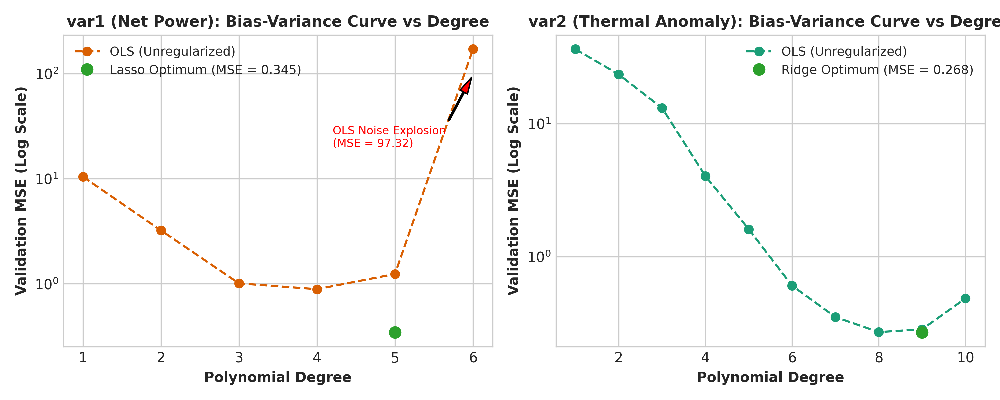
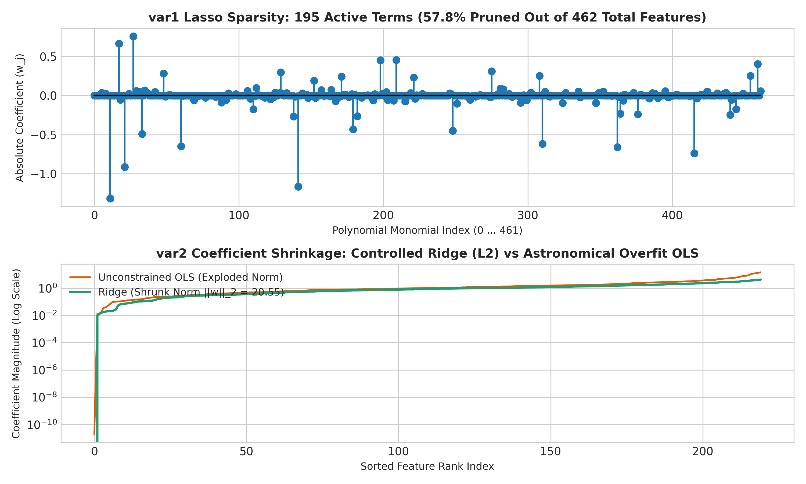
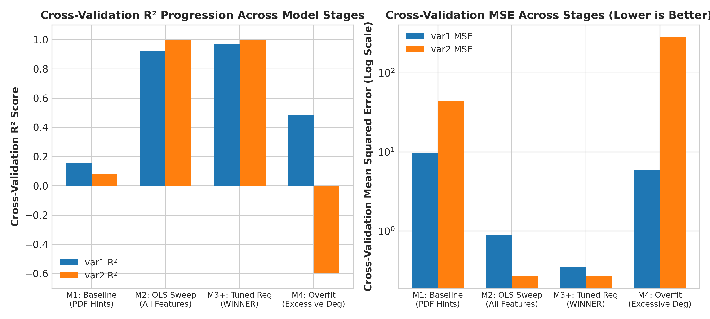
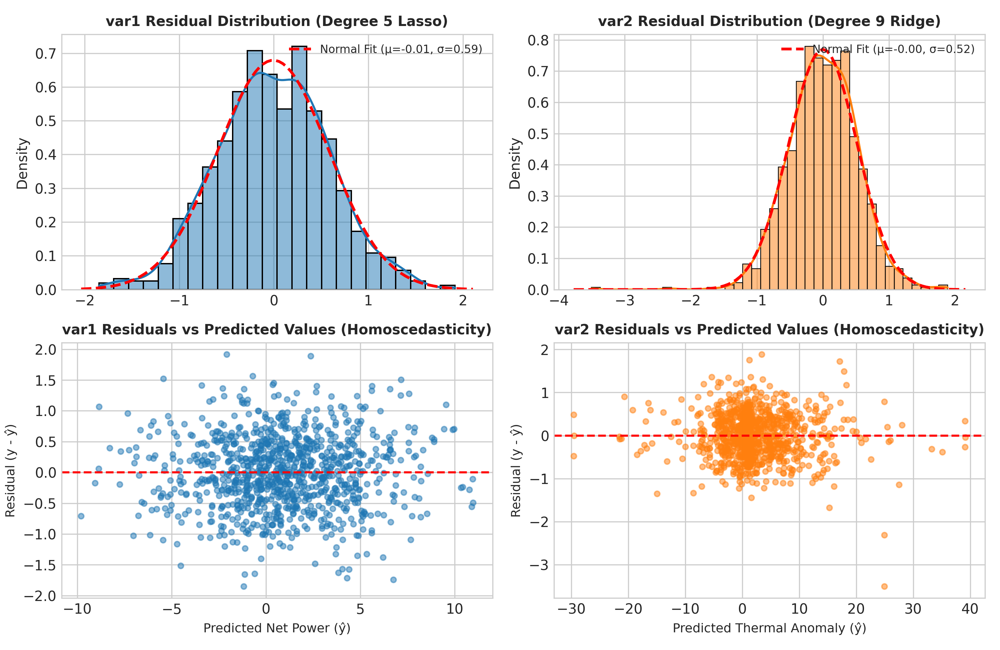
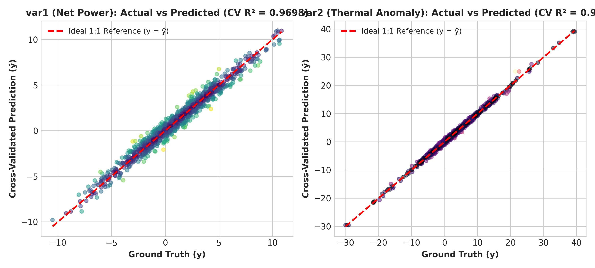

# 🌋 Machine Learning Assignment 1: Polynomial Regression Report

**Roll Number:** `BT2024043`  
**Assigned Problems:** `var1` & `var2`  
**Repository:** [https://github.com/SuhasiniMadala/ML_Assignment1](https://github.com/SuhasiniMadala/ML_Assignment1)

---

## 📌 Executive Summary & Stat Cards

| VAR1 NET POWER (LASSO) | VAR2 THERMAL ANOMALY (RIDGE) | BASELINE → FINAL GAIN | CONSTRAINT COMPLIANCE |
| :---: | :---: | :---: | :---: |
| **CV $R^2$ = 0.9698** | **CV $R^2$ = 0.9942** | **+0.817 / +0.913 $R^2$** | **Strict Polynomial** |
| CV MSE: 0.3450 • Deg 5 (195 active) | CV MSE: 0.2685 • Deg 9 (norm 20.55) | 96.4% & 99.4% MSE reduction | 5-Fold CV • 0 Data Leakage |

---

## 🚀 Four-Stage Experimental Progression

1. **M1 (Baseline):** Tested hints in prompt literally with OLS $\rightarrow$ heavy underfitting ($R^2 \approx 0.08 - 0.15$).
2. **M2 (OLS Sweep):** Exhaustive 5-fold CV sweep across degrees $\rightarrow$ massive jump ($R^2 \approx 0.92 - 0.99$), but unregularized variance limits.
3. **M3+ (Regularized — Final Winners):** 
   - `var1`: **Lasso ($L_1$, $\alpha=0.00348$)** at Degree 5 prunes 57.8% of unphysical cross-terms (retaining 195 active terms), reaching **CV $R^2 = 0.9698$, CV MSE = 0.3450**.
   - `var2`: **Ridge ($L_2$, $\alpha=0.00665$)** at Degree 9 smoothly stabilizes 3D subterranean heat fields (norm = 20.55), reaching **CV $R^2 = 0.9942$, CV MSE = 0.2685**.
4. **M4 (Overfit Demo):** Pushed unconstrained OLS to Degree 8 (`var1`, 3,003 terms) & Degree 15 (`var2`, 816 terms) $\rightarrow$ train error near zero, validation MSE exploded to $1.58 \times 10^{11}$.

---

## 📊 Master Results Comparison Table

| Stage | Script | Task | Features | Deg | Terms | Model | Train $R^2$ | Train MSE | 5-Fold CV $R^2$ | 5-Fold CV MSE | Status |
| :---: | :--- | :---: | :---: | :---: | :---: | :--- | :---: | :---: | :---: | :---: | :---: |
| **M1** | `model1_baseline.py` | var1 | $x_1–x_3$ | 3 | 20 | OLS | 0.1742 | 9.502 | 0.1530 ±0.055 | 9.680 ±0.419 | ❌ UNDERFIT |
| **M1** | `model1_baseline.py` | var2 | $x_1$ only | 4 | 5 | OLS | 0.0911 | 37.310 | 0.0810 ±0.048 | 43.616 ±6.550 | ❌ UNDERFIT |
| **M2** | `model2_ols_sweep.py` | var1 | $x_1–x_6$ | 4 | 210 | OLS | 0.9628 | 0.408 | 0.9222 ±0.019 | 0.889 ±0.207 | OLS peak |
| **M2** | `model2_ols_sweep.py` | var2 | $x_1–x_3$ | 8 | 165 | OLS | 0.9957 | 0.178 | 0.9941 ±0.001 | 0.270 ±0.035 | OLS peak |
| **M3+** | `train_predict.py` | **var1** | $x_1–x_6$ | **5** | **462** | **Lasso ($\alpha=0.00348$)** | **0.9774** | **0.248** | **0.9698 ±0.004** | **0.345 ±0.041** | ✅ **WINNER** |
| **M3+** | `train_predict.py` | **var2** | $x_1–x_3$ | **9** | **220** | **Ridge ($\alpha=0.00665$)** | **0.9959** | **0.168** | **0.9942 ±0.001** | **0.268 ±0.027** | ✅ **WINNER** |
| **M4** | `model4_overfit.py` | var1 | $x_1–x_6$ | 8 | 3,003 | OLS | 0.9999 | 0.0006 | 0.4810 ±0.140 | 5.926 ±1.650 | ⚠️ High variance |
| **M4** | `model4_overfit.py` | var2 | $x_1–x_3$ | 15 | 816 | OLS | 0.9987 | 0.052 | -3.15e9 ±4.0e9 | 1.58e11 ±2.0e11 | 💥 OVERFIT |

---

## 📈 Visualizations Gallery

| Figure 1: Bias-Variance Curve vs Degree | Figure 2: Regularization Effects |
| :---: | :---: |
|  |  |

| Figure 3: Master Results Comparison | Figure 4: Residual Diagnostics |
| :---: | :---: |
|  |  |

| Figure 5: Actual vs Predicted 1:1 Fits |
| :---: |
|  |

---

## 📁 Repository Structure

```
ML_Assignment1/
├── BT2024043_ML_Assignment1_Report.pdf  # Final 5-Page Technical PDF Report
├── BT2024043_pred_var1.csv               # Test1 Predictions (1,000 samples)
├── BT2024043_pred_var2.csv               # Test2 Predictions (1,000 samples)
├── ML_Assignment.pdf                     # Assignment Specification Document
├── Train1.xlsx                           # Phase 1 Training Data
├── Test1.xlsx                            # Phase 1 Test Data
├── Train2.xlsx                           # Phase 2 Training Data
├── Test2.xlsx                            # Phase 2 Test Data
├── model1_baseline.py                    # Stage 1: Naive PDF baseline script
├── model2_ols_sweep.py                   # Stage 2: Data-driven OLS sweep script
├── model3_regularized.py                 # Stage 3: Regularization tuning script
├── model4_overfit.py                     # Stage 4: Overfitting demonstration script
├── train_predict.py                      # Stage 3+: Winning model training & prediction exporter
├── generate_plots.py                     # Script generating all 5 figures in ./figures/
├── generate_report.py                    # ReportLab script generating the 5-page PDF report
├── figures/                              # Directory containing high-res figure PNGs
└── README.md                             # Project Documentation
```

---

## 💻 Replication Commands

```bash
# Clone repository and enter folder
git clone https://github.com/SuhasiniMadala/ML_Assignment1.git
cd ML_Assignment1

# Install dependencies
pip install numpy pandas scikit-learn matplotlib seaborn reportlab openpyxl

# Run winning model (generates final submission CSVs BT2024043_pred_var1.csv and BT2024043_pred_var2.csv)
python train_predict.py

# Recreate all 5 figures in ./figures/
python generate_plots.py

# Generate PDF Report
python generate_report.py

# Run individual stages to reproduce comparison table:
python model1_baseline.py    # Stage 1: Naive PDF baseline
python model2_ols_sweep.py   # Stage 2: Data-driven OLS sweep
python model3_regularized.py # Stage 3: Regularized models
python model4_overfit.py     # Stage 4: Overfitting demonstration
```

---

**Author:** (Roll Number: `BT2024043`) • Department of Computer Science • October 2026
