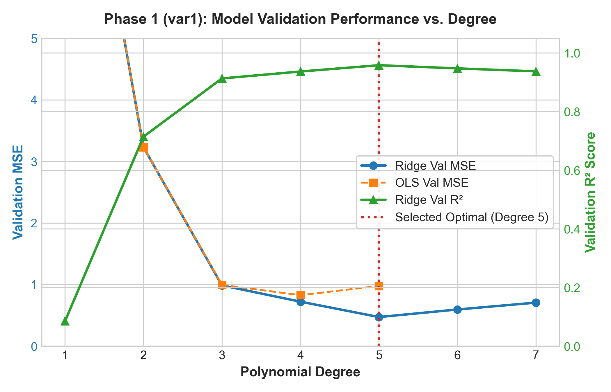
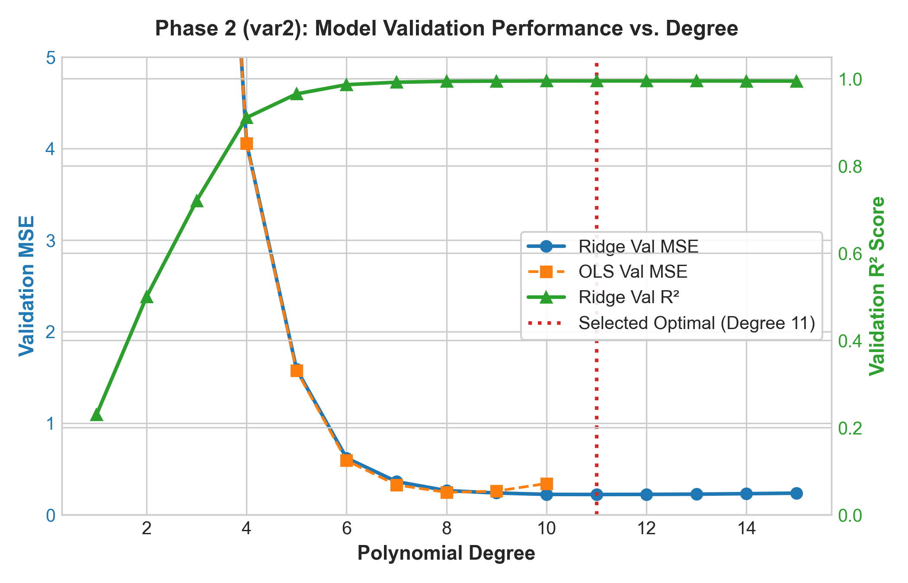
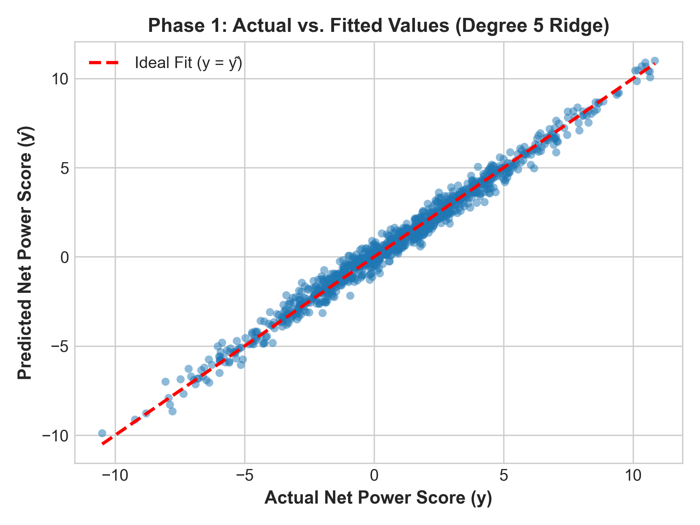
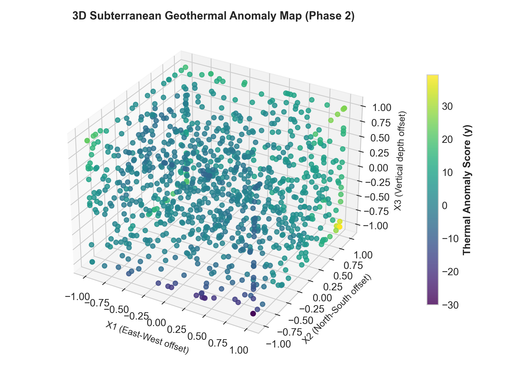

# 🌋 Geothermal Energy Polynomial Regression Analysis

[](https://www.python.org/)
[](https://scikit-learn.org/)
[](LICENSE)

A end-to-end Machine Learning pipeline and empirical investigation into **Polynomial Regression** models for geothermal renewable energy engineering, covering multi-stage turbine power optimization and 3D subterranean thermal anomaly mapping.

---

## 📌 Executive Summary & Problem Formulation

This project addresses two continuous target prediction challenges using polynomial regression models built from scratch and validated with 10-Fold Cross-Validation:

### ⚡ **Phase 1: Power Plant Steam Turbine Optimization (`var1`)**
* **Goal:** Model the **Net Power Score ($y$)** of a multi-stage geothermal steam turbine based on six operational parameters:
  * $x_1$: High-pressure steam valve adjustment
  * $x_2$: Condenser coolant flow rate adjustment
  * $x_3$: Re-injection pump hydraulic pressure
  * $x_4$: Turbine blade pitch angle
  * $x_5$: Non-condensable gas exhaust valve rate
  * $x_6$: Steam inlet pressure adjustment
* **Selected Model:** **Polynomial Degree 5 with Ridge Regression ($\alpha = 12.0$)**
  * **10-Fold CV MSE:** `0.4734`
  * **10-Fold CV $R^2$:** `0.9583`

---

### 🗺️ **Phase 2: Subterranean Thermal Reservoir Mapping (`var2`)**
* **Goal:** Predict the **Thermal Anomaly Score ($y$)** across a 3D geological survey block to identify high-yield geothermal extraction well coordinates:
  * $x_1$: East-West coordinate offset (meters)
  * $x_2$: North-South coordinate offset (meters)
  * $x_3$: Vertical depth offset relative to basecamp (meters)
* **Selected Model:** **Polynomial Degree 11 with Ridge Regression ($\alpha = 1.0$)**
  * **10-Fold CV MSE:** `0.2227`
  * **10-Fold CV $R^2$:** `0.9951`

---

## 📊 Cross-Validation Performance Summary

### **Phase 1 (`var1`): Polynomial Degree vs Validation Metrics**

| Degree | Monomial Terms | OLS Val MSE | OLS Val $R^2$ | Ridge Val MSE ($\alpha=12.0$) | Ridge Val $R^2$ ($\alpha=12.0$) |
| :---: | :---: | :---: | :---: | :---: | :---: |
| 1 | 7 | 10.3846 | 0.0848 | 10.3821 | 0.0852 |
| 2 | 28 | 3.2312 | 0.7145 | 3.2304 | 0.7147 |
| 3 | 84 | 0.9950 | 0.9125 | 0.9875 | 0.9133 |
| 4 | 210 | 0.8290 | 0.9278 | 0.7230 | 0.9368 |
| **5 (Optimal)** | **462** | **0.9785** | **0.9125** | **0.4734** | **0.9583** |
| 6 | 924 | N/A (Overfit) | N/A | 0.5961 | 0.9474 |
| 7 | 1716 | N/A (Overfit) | N/A | 0.7075 | 0.9374 |

---

### **Phase 2 (`var2`): Polynomial Degree vs Validation Metrics**

| Degree | Monomial Terms | OLS Val MSE | OLS Val $R^2$ | Ridge Val MSE ($\alpha=1.0$) | Ridge Val $R^2$ ($\alpha=1.0$) |
| :---: | :---: | :---: | :---: | :---: | :---: |
| 1 | 4 | 36.1287 | 0.2302 | 36.1284 | 0.2303 |
| 2 | 10 | 23.2342 | 0.5003 | 23.2338 | 0.5003 |
| 3 | 20 | 12.9209 | 0.7202 | 12.9176 | 0.7204 |
| 4 | 35 | 4.0550 | 0.9111 | 4.0604 | 0.9110 |
| 5 | 56 | 1.5753 | 0.9658 | 1.5899 | 0.9654 |
| 6 | 84 | 0.5934 | 0.9871 | 0.6212 | 0.9865 |
| 7 | 120 | 0.3272 | 0.9929 | 0.3633 | 0.9922 |
| 8 | 165 | 0.2454 | 0.9947 | 0.2650 | 0.9943 |
| 9 | 220 | 0.2594 | 0.9943 | 0.2394 | 0.9948 |
| 10 | 286 | 0.3426 | 0.9926 | 0.2238 | 0.9951 |
| **11 (Optimal)** | **364** | **0.5396** | **0.9887** | **0.2227** | **0.9951** |
| 12 | 455 | 0.6282 | 0.9850 | 0.2239 | 0.9951 |
| 13 | 560 | 2.1360 | 0.9526 | 0.2261 | 0.9951 |

---

## 📈 Visualizations

| Phase 1: Error vs Degree & Residual Fit | Phase 2: Error vs Degree & 3D Spatial Anomaly Map |
| :---: | :---: |
|  |  |
|  |  |

---

## 📁 Repository Structure

```
ML_Assignment1/
├── ML_Assignment.pdf              # Assignment Specification Document
├── Polynomial_Regression_Report.pdf # Final 2-Page Technical Report
├── Train1.xlsx                    # Phase 1 Training Data (1,000 samples)
├── Test1.xlsx                     # Phase 1 Test Data (1,000 samples)
├── Train2.xlsx                    # Phase 2 Training Data (1,000 samples)
├── Test2.xlsx                     # Phase 2 Test Data (1,000 samples)
├── pred_var1.csv                  # Phase 1 Predictions on Test1
├── pred_var2.csv                  # Phase 2 Predictions on Test2
├── sample_submission (1).csv      # Reference Submission Format
├── train_and_predict.py           # Model Training & Inference Script
├── generate_report.py             # PDF Report Generator Script
├── p1_degree_vs_error.png         # Phase 1 Degree Validation Plot
├── p1_pred_vs_actual.png          # Phase 1 Actual vs Fitted Scatter Plot
├── p2_degree_vs_error.png         # Phase 2 Degree Validation Plot
├── p2_3d_spatial_map.png          # Phase 2 3D Subsurface Scatter Plot
├── README.md                      # Project Documentation
└── .gitignore                     # Git Exclusion File
```

---

## 🚀 Quickstart Guide

### 1. Requirements
Install the required Python dependencies:
```bash
pip install pandas numpy scikit-learn matplotlib seaborn reportlab openpyxl
```

### 2. Train Models & Generate Test Predictions
Run the full training, 10-Fold CV evaluation, and inference pipeline:
```bash
python train_and_predict.py
```
Outputs generated:
* `pred_var1.csv` (Predictions for `Test1.xlsx`)
* `pred_var2.csv` (Predictions for `Test2.xlsx`)
* High-resolution PNG plots for evaluation

### 3. Generate Technical PDF Report
Compile the publication-quality 2-page PDF report:
```bash
python generate_report.py
```
Outputs generated:
* `Polynomial_Regression_Report.pdf`

---

## 📝 License
This project is open source under the MIT License.
